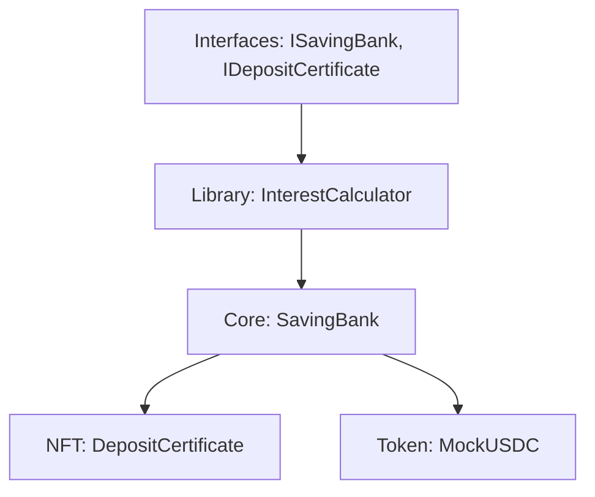

# 🛠️ Saving Banking Revamp — Tài Liệu Yêu Cầu Kỹ Thuật

Tài liệu này chi tiết hóa các nguyên tắc thiết kế, cấu trúc hệ thống và các tiêu chuẩn kỹ thuật áp dụng cho dự án Saving Banking.

---

## 1. NGUYÊN TẮC CLEAN CODE (BẮT BUỘC)

### 1.1 Áp Dụng SOLID Principles

| Nguyên tắc | Mô tả ứng dụng cụ thể |
| :--- | :--- |
| **S**ingle Responsibility | Mỗi Contract đảm nhận một vai trò duy nhất: `SavingBank` (Logic nghiệp vụ), `DepositCertificate` (Quản lý NFT), `InterestCalculator` (Tính toán toán học). |
| **O**pen/Closed | Sử dụng Interface `ISavingBank` để cho phép mở rộng tính năng mà không cần sửa đổi mã nguồn cốt lõi. |
| **L**iskov Substitution | Đảm bảo các Contract kế thừa từ OpenZeppelin tuân thủ nghiêm ngặt Interface chuẩn. |
| **I**nterface Segregation | Chia nhỏ Interface: `ISavingBankAdmin`, `ISavingBankUser`, `ISavingBankView` để giảm thiểu sự phụ thuộc không cần thiết. |
| **D**ependency Inversion | Các Module cấp cao không phụ thuộc vào Module cấp thấp, cả hai đều phụ thuộc vào Abstraction (Interface). |

### 1.2 Quy Tắc Đặt Tên (Naming Conventions)

*Tuyệt đối không sử dụng từ viết tắt gây khó hiểu.*

| Đối tượng | Quy tắc | Ví dụ chuẩn |
| :--- | :--- | :--- |
| **Contract** | PascalCase, Danh từ đầy đủ | `SavingBank`, `DepositCertificate` |
| **Function** | camelCase, Động từ + Danh từ | `createSavingPlan`, `calculateInterest` |
| **Variable** | camelCase, Danh từ mô tả | `depositAmount`, `maturityTimestamp` |
| **Constant** | SCREAMING_SNAKE_CASE | `BASIS_POINTS`, `SECONDS_PER_YEAR` |
| **Event** | PascalCase, Quá khứ phân từ | `DepositOpened`, `PlanCreated` |
| **Error** | PascalCase, Mô tả trạng thái lỗi | `PlanNotEnabled`, `InsufficientBalance` |
| **Mapping** | Prefix mô tả Key-to-Value | `depositIdToRecord`, `planIdToDetails` |

### 1.3 Cấu Trúc Mã Nguồn (Flat Logic)

Yêu cầu sử dụng **Guard Clauses** thay vì lồng ghép `if` quá sâu (Nested Logic).

```solidity
// ✅ PHƯƠNG PHÁP ĐÚNG - Guard clauses & Helper functions
function withdraw(uint256 depositId) external {
    _validateDepositOwnership(depositId, msg.sender);
    _validateDepositNotClosed(depositId);
    
    if (_isDepositMature(depositId)) {
        _processMaturityWithdrawal(depositId);
    } else {
        _processEarlyWithdrawal(depositId);
    }
}
```

---

## 2. KIẾN TRÚC HỆ THỐNG

### 2.1 Sơ Đồ Logic Contract

Hệ thống được thiết kế theo mô hình Modular để tách biệt hoàn toàn các trách nhiệm.



### 2.2 Tách Biệt Vai Trò Token và NFT

| Đặc tính | ERC20 (MockUSDC) | ERC721 (DepositCertificate) |
| :--- | :--- | :--- |
| **Mục đích** | Tài sản gửi và trả lãi (Stablecoin). | Chứng chỉ sở hữu khoản tiết kiệm. |
| **Tương tác** | User nạp/rút thông qua SavingBank. | Chỉ SavingBank có quyền Mint/Burn. |
| **Khả năng chuyển nhượng** | Tự do theo chuẩn ERC20. | **Transferable - người sở hữu NFT có quyền rút tiền**. |
| **Quyền rút tiền** | N/A | **NFT owner (không phải depositor gốc)** |
| **Đơn vị** | 6 Decimals (chuẩn USDC). | Unique Token ID (DepositId). |

---

## 3. CẤU TRÚC DỮ LIỆU (DATA STRUCTURES)

### 3.1 SavingPlan (Gói Tiết Kiệm)
Mô tả cấu hình nghiệp vụ của một sản phẩm tiết kiệm.

```solidity
struct SavingPlan {
    uint256 planId;
    uint64 tenorSeconds;              // Thời gian đáo hạn (giây)
    uint32 annualInterestRateBps;     // Lãi suất năm (1% = 100 bps)
    uint256 minimumDeposit;           // Mức gửi tối thiểu
    uint256 maximumDeposit;           // Mức gửi tối đa (0 = không giới hạn)
    uint32 earlyWithdrawalPenaltyBps; // Tỷ lệ phạt rút trước hạn
    address penaltyReceiver;          // Địa chỉ nhận tiền phạt
    bool isEnabled;                   // Trạng thái hoạt động
}
```

### 3.2 DepositRecord (Hồ Sơ Tiết Kiệm)
Lưu trữ thông tin chi tiết của mỗi khoản gửi.

```solidity
struct DepositRecord {
    uint256 depositId;
    address depositor;        // Người gửi ban đầu
    uint256 planId;
    uint256 principalAmount;  // Số tiền gốc gửi vào
    uint64 depositTimestamp;  // Thời điểm thực hiện gửi
    uint64 maturityTimestamp; // Thời điểm đáo hạn dự kiến
    bool isClosed;            // Trạng thái sổ (đã đóng/chưa đóng)
}
```

---

## 4. QUY TRÌNH & CÔNG THỨC NGHIỆP VỤ

### 4.1 Tính Lãi (Simple Interest)
Phép tính luôn được **Làm tròn xuống (Floor)** để đảm bảo an toàn cho quỹ hệ thống.

$$Interest = \lfloor\frac{Principal \times APR_{Bps} \times Tenor_{Seconds}}{SECONDS\_PER\_YEAR \times BASIS\_POINTS}\rfloor$$

### 4.2 Xử Lý Rút Tiền

*   **Đúng hạn (At Maturity):** `Payout = Principal + Interest`. Lãi suất rút từ Vault thanh khoản.
*   **Trước hạn (Early):** `Payout = Principal - Penalty`. `Penalty = \lfloor\frac{Principal \times Penalty_{Bps}}{BASIS\_POINTS}\rfloor`.

---

## 5. QUẢN TRỊ VÀ BẢO MẬT (SECURITY & ACCESS CONTROL)

### 5.1 Phân Quyền Roles

| Vai trò | Chức năng |
| :--- | :--- |
| **DEFAULT_ADMIN_ROLE** | Quản trị toàn quyền, gán roles khác. |
| **ADMIN_ROLE** | Quản lý Saving Plans, nạp/rút Liquidity Vault. |
| **PAUSER_ROLE** | Kích hoạt trạng thái khẩn cấp (Emergency Pause). |

### 5.2 Yêu Cầu Bảo Mật Tối Thiểu
1.  **Reentrancy Protection:** Sử dụng `nonReentrant` trên tất cả các hàm có tương tác với ngoại vi (Token transfer).
2.  **Emergency Stop:** Cơ chế `Pausable` để chặn các hành vi nạp tiền/gia hạn khi có biến cố.
3.  **Validation:** Checklist nghiêm ngặt cho mỗi giao dịch (Plan status, Balance, NFT Ownership).
4.  **🚨 CRITICAL - DEFAULT_ADMIN_ROLE Security:** 
    - Current: `bytes32(0)` - dễ bị bruteforce 
    - **Recommendation:** Transfer to multisig wallet ASAP
    - **Alternative:** Use custom role via `keccak256("ADMIN_ROLE")`

### 5.3 NFT-Based Withdrawal Security
1.  **NFT Ownership Validation:** Chỉ `depositCertificate.ownerOf()` có quyền withdraw/renew
2.  **Transfer Security:** NFT transfer → instant withdrawal rights (consider cooldown)
3.  **Secondary Market:** NFTs có thể được trade, tạo market cho deposits
4.  **Original Depositor Loss:** Người gửi tiền gốc mất quyền kiểm soát sau khi transfer NFT

---

## 6. TIẾU CHUẨN KIỂM THỬ (TESTING STANDARDS)

*   **Unit Tests:** Bao phủ 100% các hàm toán học và logic rẽ nhánh.
*   **Integration Tests:** Mô phỏng luồng nghiệp vụ hoàn chỉnh (Open -> Wait -> Withdraw/Renew).
*   **Edge Cases:** Kiểm tra các giá trị biên (0, max uint256), tình huống Vault cạn kiệt thanh khoản.
*   **Gas Analytics:** Đánh giá chi phí gas cho mỗi hành động chính của người dùng.
